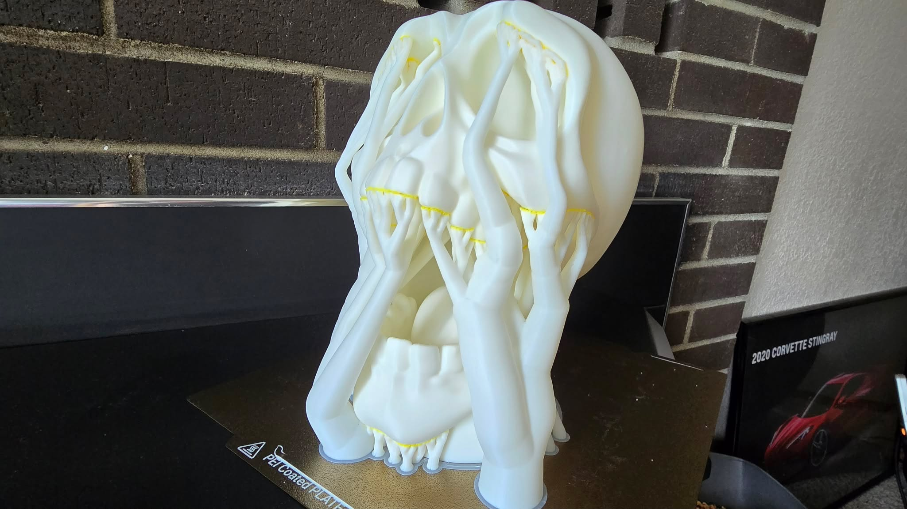
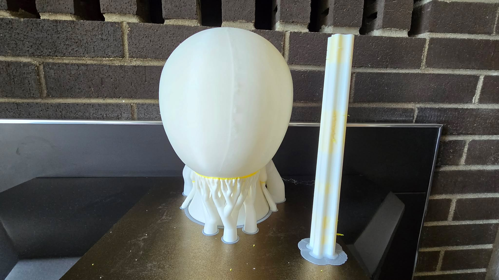

Please note that these instructions were written mostly for my mom, for the current version of SnapMaker Orca fork in August of 2026 and I'm sure things will change.  These steps are not exactly the same in Bambu or Mainline Orca, and are only recommended for nozzle changers at this time.  I recommend using dramatically different colors for your PLA vs your PETG.  Thank you.  

Start by selecting your filaments on the left side, in this screenshot we have PLA for 1,3, and 4 with PETG in 2.  Either PLA or PETG can be used to support the other, so if you had a PETG model that needed support you could use PLA.  

Then we edit the filament we are using as a support material, in this case the PETG.  

Check the box for it being a support material (Not soluble material, that's different) and then save it as something like, "Petg Support".

Make sure that it now shows your modified "Support" profile.  In our example that is filament 2, now our PETG Support, where I put the top red arrow.  Then select that same filament for the support raft interface, the lower red arrow.   If everything has worked correctly you will get the popup and be able to select yes.  If you do not get the popup, something didn't work as expected.  

The next step is making sure the prime tower doesn't come apart while you are printing.  You'll need to set the prime tower to do the walls in your primary material so it still has structure.  In the photo above you can see my red arrow.  

We found the supports were being thrown off of the build sheet so we halved the speed the supports were printed at.  You may need to tune these further, and if your supports are nice and short you may not need to touch this setting at all, but this worked for us.  

And here is our final result!  I'm sure that this can be tuned to be even better, but I'm pretty jazzed at where we arrived for now. Mom did have to scrape some of the PETG off the model with her fingernail, but it all came away cleanly leaving minimal sags or rough areas.  

Happy printing!

